# VueCircleMenu

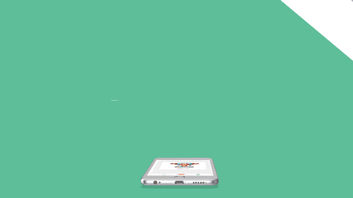


-------------------------------------------------------------------------------------------------------

## 查看中文文档，请移步至 [这里](https://github.com/OYsun/VueCircleMenu/blob/master/README-ZH.MD)

# demo
### For a better demonstration, please use the phone scan the following two-dimensional code view demo

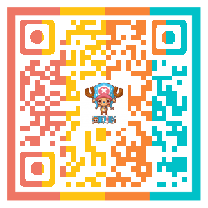

# API

## Props

| Option    | type    | Description   |
| ------------- |-------------| -----|
| type | String |Necessary,Specifies the type of menu,There are six types of：top,bottom,left,right,middle,middle-around |
| number(v1.1.0) | Number |Necessary,This is the v1.1.0 version of the api, specify the number of menus, the value should be greater than 2 less than 5, is only 2,3,4 of these three case |
| circle | boolean | Whether the menu button for rounded corners, the default for the square button |
| mask | String | There are two kinds of mask layer："white" and "black" |
| animate | String | Sub menu animation,You can import an external css animation library, such as "animate.css"|
| btn | boolean | Switch button, fill in this property, there is the default switch button, do not fill is not the default, you need to define the switch button in the slot |
| colors | Array | The background color of the buttons and menus |

## Slot

| SlotName    | Description   |
| -------------| -----|
| item_btn  | Customize the switch button |
| item_1 | The contents of the first menu |
| item_2 | The content of the second menu |
| item_3 | The content of the third menu |
| item_4 | The content of the fourth menu |

# Detailed instructions

## Props

### type
The `type` parameter is required, indicating the type of the menu, a total of about six：top,bottom,left,right,middle,middle-around

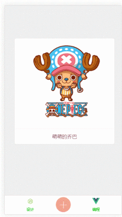

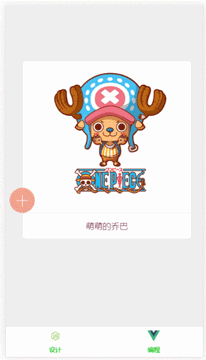
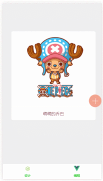

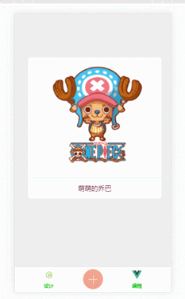


### number
The `number` parameter is required,This is the v1.1.0 version of the api, specify the number of menus, the value should be greater than 2 less than 5, is only 2,3,4 of these three case
Note:
-  when the number value of 3, `type` type for middle or middle-around is invalid
- The number parameter fills the number, but in the vue propes,If we want to pass down an actual JavaScript number, we need to use v-bind so that its value is evaluated as a JavaScript expression.For more information click [here](https://vuejs.org/v2/guide/components.html#Literal-vs-Dynamic)


## circle
Fill in `circle` to make the menu button rounded, the default is the square button：

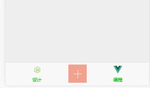
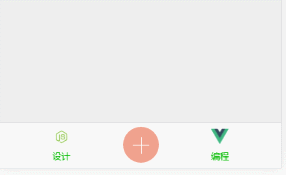

## mask
Fill in ` mask ` produces mask, divided into two kinds: "white" and "black".(Note: do not fill out or fill in the wrong type all think don't need a `mask`)

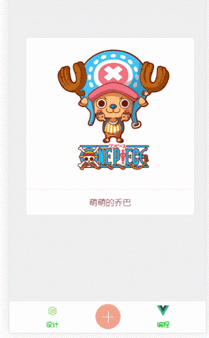


## animate
`Animate` is to add animation to the menu, as long as you can add animation css class, you can also introduce css animation library, such as `animate.css`

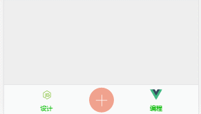
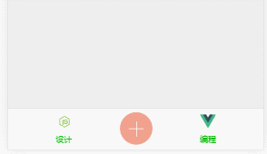
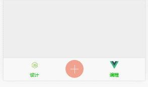


## colors
`Colors` specifies the background color of the button and menu, and does not use this property, the default color configuration is used, and the default color of the component is：

  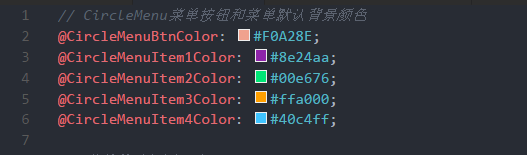

If you want to configure the color, `colors ` into an array，<b>In addition, it is important that an array of values must be color code, rather than the CSS class.</b>

```html

  <circle-menu type="bottom" :number="4" colors="[ '#563761', 'rgb(255, 255, 102)', '#FFE26F', '#F3825F', '#F19584' ]">
    <button type="button" slot="item_btn"></button>
    <a slot="item_1" class="fa fa-twitter fa-lg" herf="#" ></a>
    <a slot="item_2" class="fa fa-weixin fa-lg" herf="#" ></a>
    <a slot="item_3" class="fa fa-weibo fa-lg" herf="#" ></a>
    <a slot="item_4" class="fa fa-github fa-lg" herf="#" ></a>
  </circle-menu>
```
Note color code must be one-to-one correspondence, the first color code to refer to the button, the second color for the first menu and so on, a total of five color code, fill more, fill less or not fill in the color code is invalid

## Slot

### item_btn
The name `slot` refers to the custom switch button, and when you need to customize the switch button, do not fill in the` btn` property, use the `slot`, so you can disable the default switch button and use the custom button（Custom switch button has the advantage that you can bind events to the switch button to do further operations）

### item_1,item_2,item_3,item_4

These ` slot ` one-to-one correspondence refer to the four menu button

### principle：

According to these five `slot`,Actually means that the component is actually a parcel content box ,The contents of the box are set in `slot`

- Through `slot`, you can fill in any content, and custom style
```html
  <circle-menu type="top" :number="4">
    <button type="button" slot="item_btn"></button>
    <router-link :to="..." slot="item_1">
    <span slot="item_2"></a>
    <div slot="item_3"></a>
    
  </circle-menu>
```
- Through ` slot `, to bind any event for menu

```html
  <circle-menu type="middle-around" :number="4">
    <button type="button" slot="item_btn" @click="dosomething" ></button>
    <a slot="item_1" herf="#" @click=""></a>
    <v-touch tag="a" v-on:tap="onTap" slot="item_2"></v-touch>
    <v-touch tag="a" v-on:tap="onTap" slot="item_3"></v-touch>
    <a slot="item_4" herf="#" v-on:handler="handler"></a>
  </circle-menu>
```


## Simple example
```html
<!--"Middle" type, four sub menu, animation introduced animate.css library, white mask, round custom switch button, default menu color configuration-->
  <circle-menu type="middle" :number="4" animate="animated jello" mask='white' circle>
    <button type="button" slot="item_btn"></button>
    <a slot="item_1" class="fa fa-twitter fa-lg"></a>
    <a slot="item_2" class="fa fa-weixin fa-lg"></a>
    <a slot="item_3" class="fa fa-weibo fa-lg"></a>
    <a slot="item_4" class="fa fa-github fa-lg"></a>
  </circle-menu>
```

```html
<!--"Top" type, three sub menuthe, default animation, gray mask, square the default button, the custom color configuration menu-->
  <circle-menu type="top" :number="3" mask='black' btn colors="[ 'rgb(255, 255, 102)', '#A7425C', '#FFE26F', 'F3825F', '#F19584' ]">
    <a slot="item_1" class="fa fa-twitter fa-lg"></a>
    <a slot="item_2" class="fa fa-weixin fa-lg"></a>
    <a slot="item_3" class="fa fa-weibo fa-lg"></a>
  </circle-menu>
```

# Installation and use

```javascript
npm install vue-circle-menu
```

- If used as a global component

```javascript
//In the project entry file
import Vue from 'vue'
import CircleMenu from 'vue-circle-menu'
Vue.component('CircleMenu', CircleMenu)
```

- If as a local component

```javascript
//In a component
import CircleMenu from 'vue-circle-menu'
export default {
  components: {
    CircleMenu
  }
}
```
# Bug and suggestions

If you encounter problems or suggestions in the use, welcome to `issues`

# LICENSE

MIT
